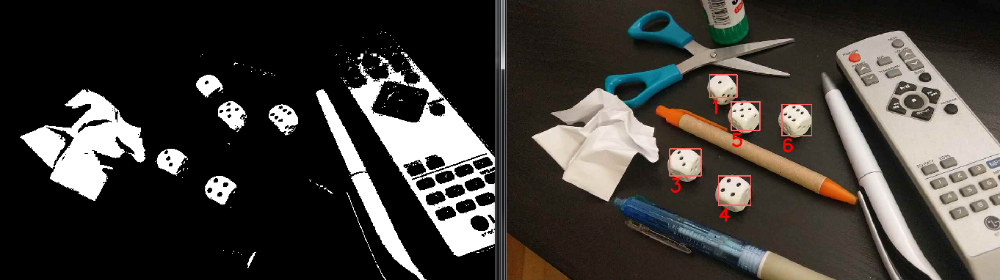
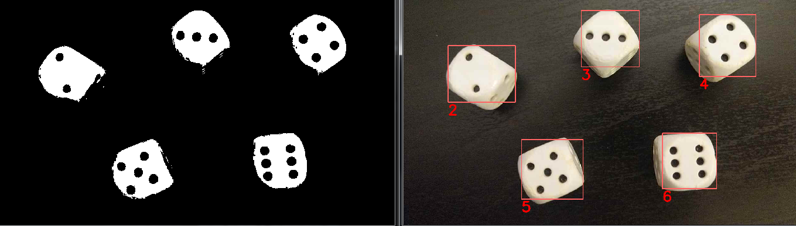

# Dice dots counter

University project for "Human-computer interaction". 
Application that counts the number of dots in dices using findContours method and SimpleBlobDetector class 
from webcam or smartphone camera in real-time using OpenCV package.

## Screenshots

